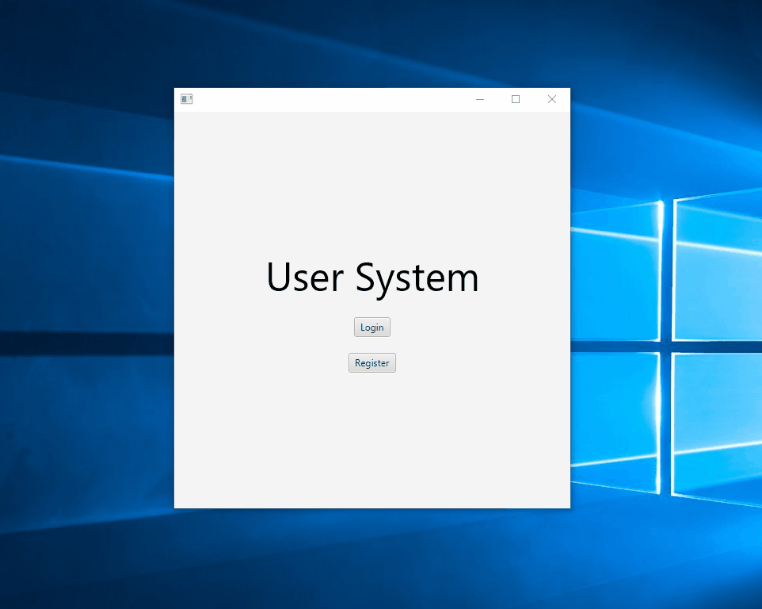

# UserSystem

UserSystem is a program I made to teach myself some basic database applications, further my knowledge in using JavaFX and applying what I learned in my Object Oriented Design course. This program is just designed for basic user functions, like a update function and a admin delete function. Everything is stored in a database. The passwords are encrypted using BCrypyt. If you have any feedback please let me know. 

# Demo

